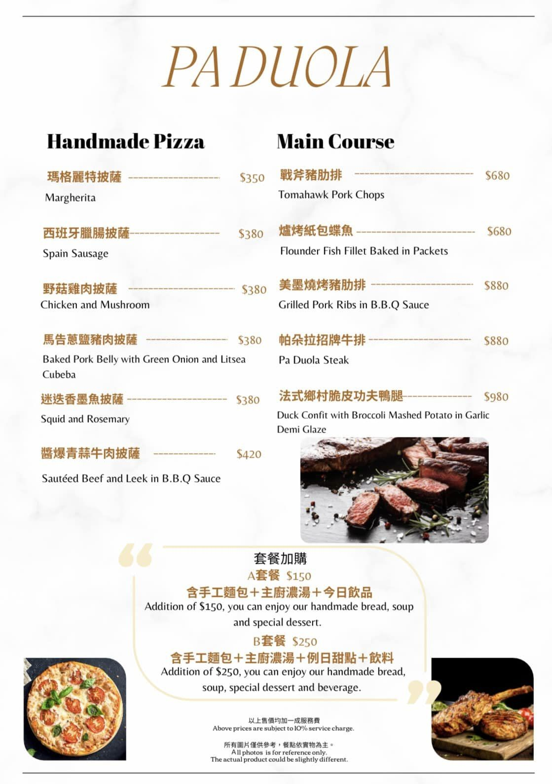

# 9/3 樂天桃猿 V.S. 兄弟象  初音日 <3

- 票價:640 

---
| Time  | Item | Description | 
|:-----:|:-----:|:-----|
| ~| 交通 | - 長霖開車  - 易儒搭車? 看怎麼跟長霖約   -柄璋、俊霆、少豪自理 |
| 12:30 | 中午聚餐 | 吃飯 |
| 14:00 | 隨便走走 | 逛百貨、休息 |
| 14:30 | 買東西 | 1F家樂福 買水、零食 |
| 15:00 | 進球場 | 17:05開打 |
| 20:30 | 勝利煙火 | 一定贏的吧! 珈鋐沒來啊! |
| 21:00 | 回程 | 卓包開車  - 少豪新竹高鐵下車 <3   - 易儒搭車?   柄璋、俊霆自理 |

## 中午聚餐選項參考
  1. 開飯 川食堂 
      - 台式合菜
      - 約 700 人/元  
      - https://www.kaifun.com.tw/zh-TW/menu/menuSet
      
  2. 咖哩樹
     - 日式咖哩、鍋物定食套餐
     - 約 300~400 / 套餐
     - https://www.facebook.com/photo/?fbid=251956883849238&set=p.251956883849238
     
  3. 慕特牛排
     - 排餐(牛、豬、雞...)
     - 約 500~800 人/套餐
      
  4. 一條通 壽司
     - 壽司
     - 40~60元 / 盤
     - https://zineblog.com.tw/blog/post/220223
     - 
  5. 柚子花花客家菜
     - 合菜
     - 約500~600 /人
     - https://www.facebook.com/photo.php?fbid=707927248009405&set=pb.100063764085326.-2207520000&type=3&locale=zh_TW
     
  6. 星悅新加坡料理
    - 新加坡料理 套餐 
    - 約 300~400 /套餐
    - https://hanhan00.pixnet.net/blog/post/336260996
     
  7. 帕朵拉義式餐廳 
     - 義式套餐
     - 500~600 套餐
     -https://www.facebook.com/photo/?fbid=179994147921144&set=pb.100077316805840.-2207520000
     

